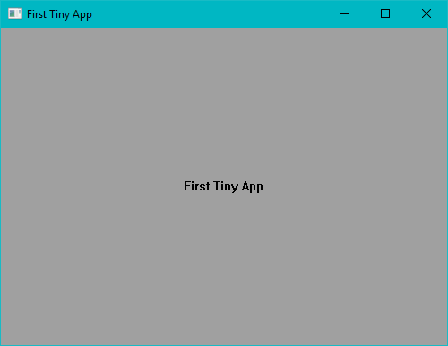

# First Assembly Windows

Create a tiny **Windows** graphical application using pure **Assembly**. (MASM)

> If you are new to Assembly in Windows, you need to install **MASM32** first. I already uploaded the setup file to the repository. so you can easily download and install its setup. I downloaded it from the internet. For security reasons, you can download it from official sources to make sure.



## Running

```sh
git clone https://github.com/BaseMax/FirstAssemblyWindows
cd FirstAssemblyWindows
HelloAssembly
```

# Compile, Link and build

```sh
ml /coff HelloAssembly.asm
```

## Next

I just noticed an update on this topic from "Artemis Meursault Gerrard" in which he succeed in breaching the limitation and did it in such a way that still works. Her version is smaller than what we see here and Dave's version.

Link for ASM lovers:
https://github.com/OMGtechy/tinydoze

#### Credit

I just exercising to learn more, I did whatever Dave did. Thank you from Dave.
